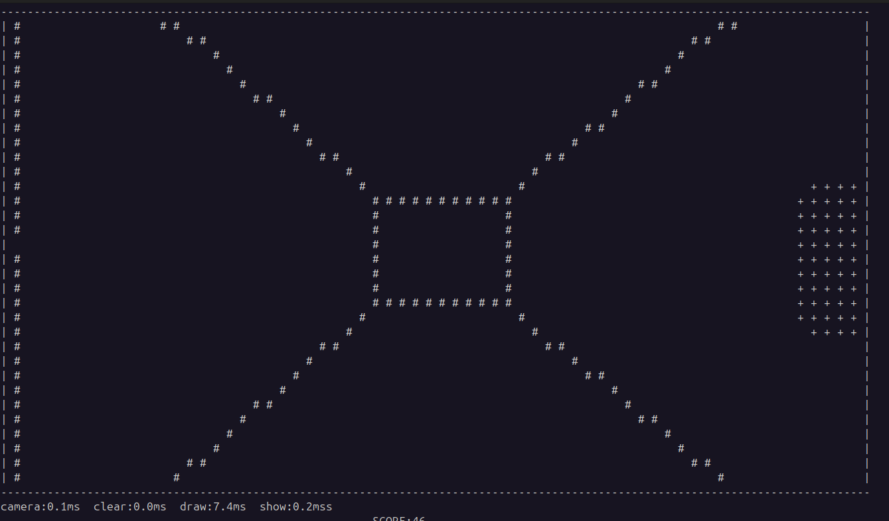

# Liquid-Red

A 3D game engine in python using only TUI. The project includes a game with 3D engine and the 3D engine itself.

The game is an infinite runner, with infinite procedural generation the objective of the player is to run as far as they can
without colliding with objects. It implements a corridor in which the player runs indefinitely until it collides with an obstacles 
ps: you can jump too!

The 3D game engine, came out perfect, so we decided to have it published as a python library.  
**Pypi**: https://pypi.org/project/LiquidRed/  
**Docs**: https://liquidred.readthedocs.io/en/latest/index.html 
As of now it is installable using `pip install liquidred` and it can be used make to more unique games!!!!!

The detailed function wise breakdown and api reference is available at the docs. In this report, I have covered modular
breakdown.

## What the 3D engine does:
+ Perspective Projection (more accurate than raycasting)
+ Z-buffer for, front to back display
+ barycentric triangle rasterization for surfaces rather than scanline
+ lambert shading using ASCII characters for lighting
+ Proper camera for FPV (first person view), with focal length to control FOV and zoom.
+ Plane helpers and Cube with collision detection using AABB bounding box method
+ Keyboard input

## Dependencies

+ numpy
+ pynput

`pip install numpy pynput`

pynput is used only for keyboard control.

## Folder Structure

### camera.py
It is the main players/FPV class, in liquidred game engine, the player is camera.
The camera handles, movement updates from the keyboard, rotation of face in xz(yaw) plane and yz(pitch) plane.

### config.py
Contains all the constants used in the game

### geometry.py
Covers helper function, requiring geometry, such as position of a point wrt to a line, surface normal, lambert cosine law
and check if points are coplanar.

### grid.py
This is the main backbone of our game engine and game itself. `Renderer` class handles all the drawing to the terminal functions. such
as draw_line(for edges/wire frame), draw_plane(for surfaces) and the perspective projection math (`project3d`)

### main.py
Contains the game loop, instances of camera and renderer. It calls all the drawing functions of the renderer.

### objects.py
Contains objects, chunks and collision detection. Currently, we use only a cube but more shapes can be added easily.
Each object contains vertices, edges and collision detection atleast.

## Motivation and Background

Modern 3D graphics are all GPU dependent, using high amounts of parallel processing that can rasterize millions of triangles
Libraries like OpenGL, DirectX abstract this hardware API and make it easy to render 3D scences without understanding the 
underlying mathematics. Hence the motivation was purely educational to learn the 3D rendering pipeline from scratch using
only pure Python and NumPy. The terminal as a display medium is an intentional constraint, a terminal is fundamentally 2D
with no colors, no subpixels (only integral pixels) and because we wanted to build everything from scratch. We implement every
step of 3D pipeline explicitly -> transforming world-coordinates to camera space (using rotation matrices), Projecting 3D onta a 2D plane using perspective division
(which is just simple mathematics using properties similar triangles!!), resolving depth conflicts with z-buffer and coomputing
lighting using lambert shading (dot product of vectors).

The project also serves as a demonstration that a real time 3D-engine with a game loop, physics, procedural generation of
chunks, collision detection, lambert shading can be built using standard Python and NumPy with delivering 60FPS.

## Relevance and Complexity

The problem addressed is fundamentally relevant to computer graphics and game development. Every modern rendering engine
is built on the same mathematical pipeline as implemented here: event manangement, FPS management, coordinates transformation
perspective projection, rasterization and depth testing. Understanding these principals are pre-requisites for debugging visual
systems or extending graphics system. Most programmers who use 3D game engine never implement these themselves. This 
project demonstrates 3D pipeline isn't magic, its linear algebra, geometric properties and coordinate geometry.

The implementation is non-trivial, it requires rigorous mathematical understanding of linear algebra, matrices and coordinate systems.
+ rotation matrices
+ perpective projection using similar triangles and focal length
+ vector cross products for lambert shading
+ DDA line rasterization to connect two integral points! We don't have subpixels so when we connect two points we implement a
line using only integral coordinates
+ Barycentric rasterization for filling triangular surfaces same problem as lines. No subpixels!

It runs a real time 60FPS with procedural infinite generation world generation, physics simulation and collision detection.
All while keeping 60FPS and without GPU! All calculations happen in the CPU.

## Readability
I have followed the numpy style docstrings for the project and ruff linting for PEP8.
Furthermore I have published the docs of the game engine for api reference.  
**DOCS**: https://liquidred.readthedocs.io/en/latest/index.html  
**GitHub for library**: https://github.com/Ibrahim2750mi/Liquid-Red  
**GitHub of game with library**: https://github.com/Ibrahim2750mi/Liquid-Red/tree/main  

Both are well documented, while the library version is documented more systematically as it is a published library.

## Generalizability and extendibility

The library is open source. It can accept pull requests, github issues. Everything is well-maintained. 
**library**: https://pypi.org/project/LiquidRed/  

There exists an `Object` class in `objects.py` which can be inherited to create more objects. In future text rendering into the grid
can also be added. Renderer can accept any Camera class, hence there can be multiple POV(s) inside a game.
Further the library can itself be used to create more ridiculous games!

## Topics Coverage

| Topic                          | Where                                                                                                                                                                           |
|--------------------------------|---------------------------------------------------------------------------------------------------------------------------------------------------------------------------------|
| Classes                        | Renderer, Camera, Object, Cube, Chunk                                                                                                                                           |
| NumPy Vectorization            | draw_line, draw_triangle, show_grid, clear_grid in grid.py                                                                                                                      |
| numpy.linalg.norm              | compute_surface_normal in geometry.py                                                                                                                                           |
| np.dot                         | check_coplanar in geometry.py                                                                                                                                                   |
| np.cross                       | check_coplanar, compute_surface_normal in geometry.py                                                                                                                           |
| decorators                     | @project in draw_line and draw_triangle, projects world coordinates to camera space (3D-> 2D) accepts any number of points and passes all of them through projection in grid.py |
| sets                           | for unique keys pressed in keyboard.py                                                                                                                                          |
| staticmethod                   | used in Renderer class to check canvas bounds. self wasn't required.                                                                                                            |
| collections.namedtuple         | Point3d in geometry.py with x,y,z and Edge in objects.py with "start" and "end"                                                                                                 |
| collections.deque              | For chunk management, popleft() is used in main.py                                                                                                                              |
| functools.lru_cache            | Used in geometry.py for check_coplanar, computer_surface_normal, get_lambert_char                                                                                               |
| itertools.count                | objects.py: chunk_generator                                                                                                                                                     |
| itertools.islice               | main.py chunk seeding                                                                                                                                                           |
| itertools.chain.from_iterable  | main.py face/edge flattening                                                                                                                                                    |
| class inheritance / base class | objects.py: Object                                                                                                                                                              |

